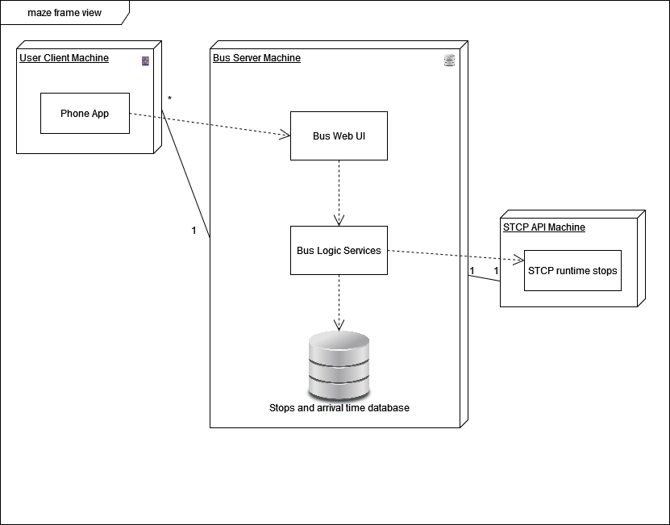

# ES-Hub

Welcome to the **ES-Hub**, a repository containing our projects for the **Software Engineering (Engenharia de Software)** course. Here, you'll find information about Maze, an app the allows users to check the location of the bus they are waiting for, more accurately using users' contributions.

#  MAZE Development Report

Welcome to the documentation pages of the MAZE App.
You can find details about our app, from a high-level vision to low-level implementation decisions, a Software Development Report, organized by types of activities.

#### ES Project made by:

- Alexandre Ramos (up202208028)
- Filipa Fidalgo (up202208039)
- Francisco Afonso (up202208115)
- Leonor Couto (up202205796)

## Vision Statement

Our app aims to streamline and enhance the public bus transportation experience. The app incorporates a Cooperation Leaderboard to encourage user engagement and contribution, enhancing the travel experience. A key feature is the quality control system, which relies on user upvotes and downvotes to ensure the reliability of the information provided. Users can also report any unusual bus operation activity directly through the app, contributing to a safer and more efficient transportation system. 

#### The full list of the implemented features:

- Access information by bus stop or bus line
- Plan Journey by selecting bus stops on a map
- Cooperation Leaderboard
- Quality control system based on upvotes and downvotes
- Report unusual activity on the operation of the bus
- Mark when catch a bus
- Save progress by linking to other platforms' accounts

## Table of Contents

- [Requirements](#requirements)
- [Use Case Diagram](#use-case-diagram)
- [Architecture and Design](#architecture-and-design)

## Requirements

## Use Case Diagram

## Architecture and Design

### Logical architecture

### Physical architecture

## Sprint 1
### Beginning

### End

### Completed User Stories
 - [User Story #3](https://github.com/FEUP-LEIC-ES-2023-24/2LEIC13T5/issues/3)
 - [User Story #9](https://github.com/FEUP-LEIC-ES-2023-24/2LEIC13T5/issues/9)
 - [User Story #11](https://github.com/FEUP-LEIC-ES-2023-24/2LEIC13T5/issues/11)
 - [User Story #12](https://github.com/FEUP-LEIC-ES-2023-24/2LEIC13T5/issues/12)

### Sprint Assessment

 This first sprint was really productive and very challenging. We accomplished more than expected, because we had a design upgrade while still doing everything asked in the user stories. Because it was the first sprint we had to learn a lot because it was the first time we were using these tools. In summary it was a very good and productive sprint.

## Sprint 2
### Beginning

### End

### Completed User Stories
 - [User Story #1](https://github.com/FEUP-LEIC-ES-2023-24/2LEIC13T5/issues/1)
 - [User Story #2](https://github.com/FEUP-LEIC-ES-2023-24/2LEIC13T5/issues/2)
 - [User Story #6](https://github.com/FEUP-LEIC-ES-2023-24/2LEIC13T5/issues/6)

### Sprint Assessment

The majority of the group considers that the sprint was positive. We managed to complete some of the tasks we set out to do, but others were not possible due to assignments and exams from other courses, as well as issues with Firebase and Mockito. In summary, the group generally views the sprint as successful, since we also made some major improvements in the app's interface.

## Sprint 3
### Beginning

### End

### Completed User Stories
 - [User Story #5](https://github.com/FEUP-LEIC-ES-2023-24/2LEIC13T5/issues/5)
 - [User Story #4](https://github.com/FEUP-LEIC-ES-2023-24/2LEIC13T5/issues/4)
 - [User Story #10](https://github.com/FEUP-LEIC-ES-2023-24/2LEIC13T5/issues/10)
 - [User Story #13](https://github.com/FEUP-LEIC-ES-2023-24/2LEIC13T5/issues/13)
 - Even if there was no user story for that we created a favourites page.

### Sprint Assessment

This last sprint was harder than the others. We left 2 user stories undone due to difficulties with saving the states of the like and dislike buttons, when the page was reloaded (to show new contributions on the firebase) the buttons were reset. But the others user stories where sucessfully completed. In summary, the group is proud of the adeveloped app.
